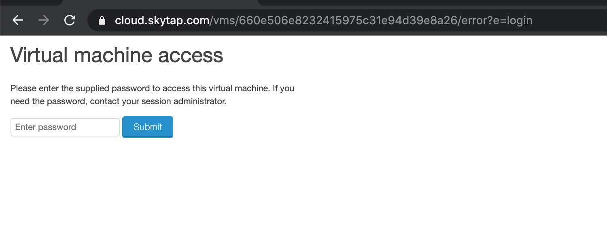
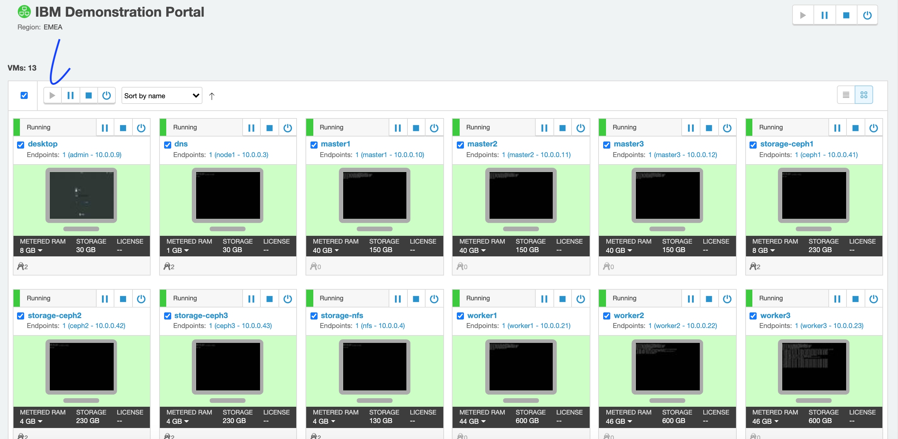
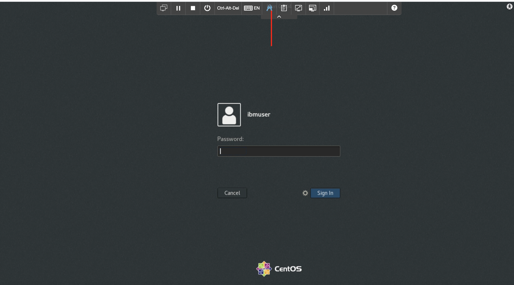
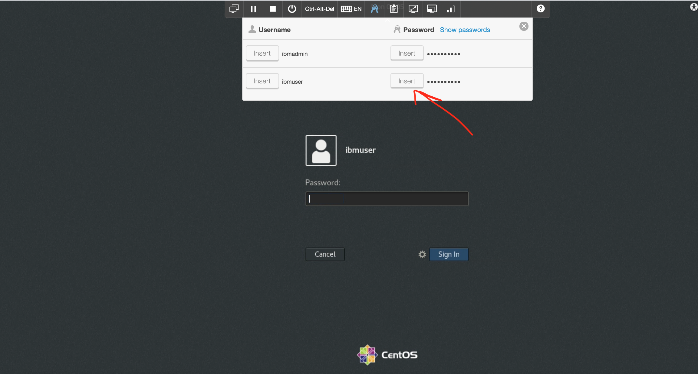
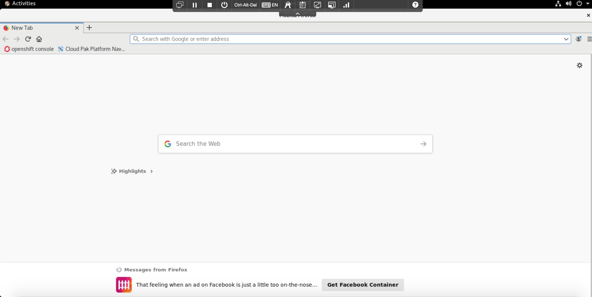
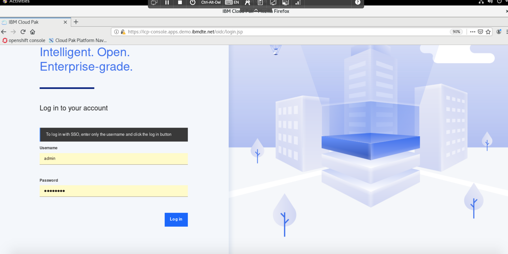

# IBM Cloud Pak for Integration :- Accessing the demo Environment

1. click on the demo link provided to each one of you and Enter the password. This should be shared with all of you, and click submit. 

2. You will land on page where you will find multiple masters . Worker nodes and one desktop. Please check all the VMs are in running state else use play button highlighted below to start all VM (this may take up to 20 mins)
Please note that these are shared environment where each instance will be shared by 4-5 person

3.  Click on desktop

4. From top menubar options use click on key which will give users and password details. click on insert of IbmUser and click submit

5.In Desktop browser used saved link to open cloud pak for integration dashboard 

6. User password are added and saved 

