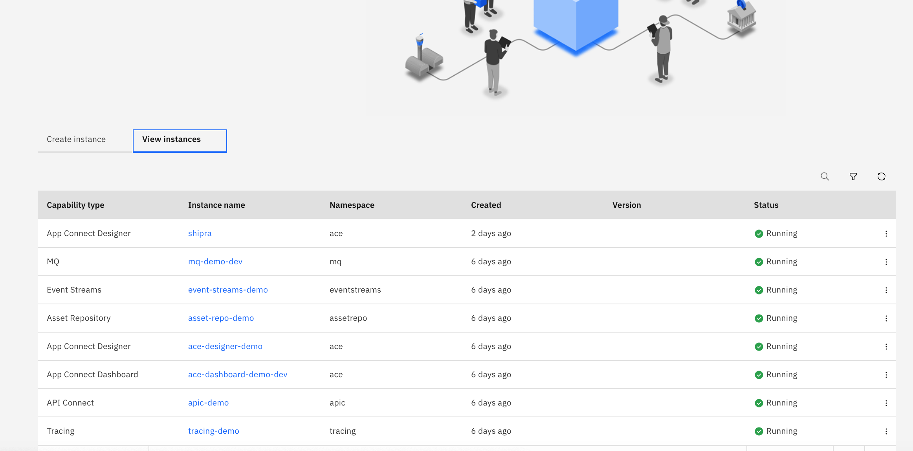
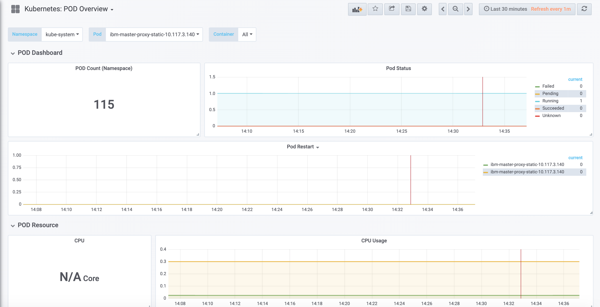

# Cloud Pak For Integration Introduction
## Agenda 
 1) Login to Demo Environment
 2) Browse through Environment
 3) Check Existing Instance
 4)  Browse Navigation and check openshift cluster (check existing namespace check how to go to navigation dashabord from openshift console)
 5) Browse Navigation and check Monitoring (Grafana)
 6) Check Logging (ELK)
  
## Introduction
This is a basic lab just to to get aquainted with cloud pak for integration environment

### 1. Login to demo Environment:
On demo dektop , used saved link to login to CP4I console. Provide user password 

### 2. You will see below screen after logging in 

### 3. Check Instance tab to see existing instance 

### 4. Browse Navigation option

### 5. Check Openshift cluster by clicking OpenShift Console from navigation pane and click on projects

#### Search for integartion project 

#### click on integration , and scroll down for inventory. Inventory provides the details about the resources that are part of given project

#### Click on route to see service that is exposed as a route . Navigation routes provides you direct access to CP4I environment. When you click on location you will land in CP4I homepage

### 6. Logging and monitoring are part of common services provided bundles with CP4I
Go to Navigation pane and click on Monitoring . You will be redirected to Grafana dashboard

You can alwasy monitor based on pods and namespace click on kubernetes pod overview

Now select ace in namespace and select specific pod You can monitor details about specific pod in any project 

### 7. Logging using kibana
From Navigation pane click on logging. This will take you to kibana dashboard

Again you can check specifc project by selecting appropriate resources from left hand selection pane

